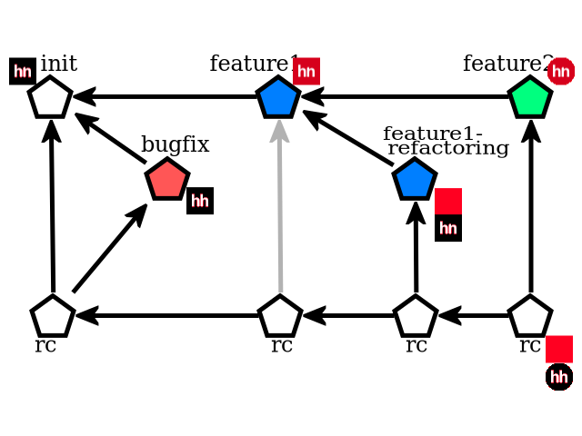

# Конструктор репозитория
## Что понадобится для выполнения
* Аккаунт на [Github](https://github.com)
* Установленный [Git](https://git-scm.com)
* Установленный [python](https://www.python.org). Скрипт проверял на 2.7, но по идее он должен заработать и на 3.x
* Любой unix-совместимый shell. Например: bash или GitBash для Windows  
_В Windows возможны проблемы с доступностью python в окружении GitBash. Если никак не получается настроить окружение, то можно написать скрипт для cmd или powershell_  
> Совет: раздобудьте Linux - на виртуальной машине или в [Docker](https://www.docker.com)
> Плюсы:
>+ shell из коробки
>+ python из коробки
>+ простая установка git
>+ в любом проде 9 из 10 будет Linux
* Доступ в Интернет:)
## Задача
* В качестве результата задачи я ожидаю Pull Request в этот репозиторий, содержащий скрипт, который конструирует git-репозиторий определенной [структуры](#user-content-Структура)
* В сообщении PR вы пишете ФИО, а в описании указываете любые детали, о которых мне нужно знать для успешного выполнения скрипта
### Требования к скрипту
* Скрипт должен работать, находясь в корне этого репозитория
* Скрипт должен создавать **новый** репозиторий в текущей директории(в той, в которой скрипт запускается)
* **Скрипт не должен в процессе работы требовать ручного ввода**
* Cкрипт может быть написан так, чтобы быть исполняемым, но это не обязательно
### Требования к репозиторию
* Репозиторий должен хранить файлы с текстовым представлением пикселей, получаемым с помощью [to_text](#user-content-Инструменты)
* Сообщения к коммитам должны быть в формате {что делаем} [файлы используемые при генерации по порядку] -> {имя выходного файла}  
Если преобразований несколько, то через запятую.  
Например: _bugfix [init.png bugfix.png] -> main.data_  
### Структура

> Суть задачи сводится к расположению "кубиков" изображения в правильном порядке для каждого коммита, указанного в структуре. 
> Правильную последовательность можно определить на основании знаний о том, как работает Git.
> ..ну или проведя значительное число случайных экспериментов
#### Описание
* init - начальное состояние. Включает только init.png
* bugfix - исправляем баг "hn" -> "hh"
* feature1 - делаем фон красным
* feature1-refactoring - подумали,что фон будет лучше отделить от основного изображения
* feature2 - закругляем края. Делаем основное изображение скругленным по краям
* rc - Release Candidate - пытаемся последовательно собрать сделанные задачи и подготовить их к релизу.
В этой ветке должно получиться исправленное скругленное основное изображение и фон в отдельном файле
### Инструменты
#### hhgit.py - вспомогательная утилита, которая используется для преобразований картинок в текст и обратно
**До использования запустите `pip install -r requirements.txt`, чтобы добавить нужные зависимости**  
> Код по установке зависимостей включать в скрипт не обязательно
  
`to_text` - используется для преобразования картинок в текстовое представление. Для вызова  из скрипта:  
`python -c "import hhgit; hhgit.to_text(['img/refactoring.png', 'img/feature2.png', 'img/init.png', 'img/bugfix.png'], 'main.data')"`  
`['img/refactoring.png', ..]` - список файлов по порядку, которые будут конвертированы  
`main.data` - имя файла, в который будут складываться результаты(относительно текущей директории)  
  
`from_text` - используется для обратного преобразования из текста в картинку. Ее полезно использовать для отладки. Для вызова из скрипта:  
`python -c "import hhgit; hhgit.from_text(['../train_repo/ground.data', '../train_repo/main.data'], 'main.png')"`  
`['../train_repo/ground.data',  ..]` - список файлов по порядку, которые будут конвертированы  
`main.png` - путь к файлу, в который будет рендериться картинка(относительно текущей директории)  

## Продвинутый уровень
* Дополнить скрипт, чтобы он после завершения основной логики вставил первой строчкой в каждый файл каждого коммита репозитория комментарий
* Комментарий начинается с `#`
* В комментарии напишите сколько времени (в часах) заняло выполнение задания)
